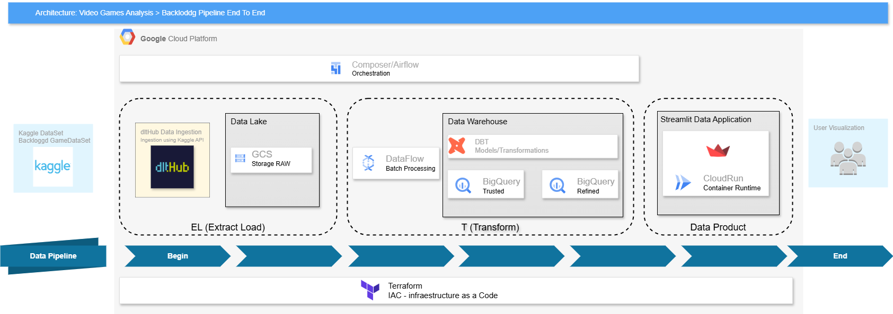

# DataGamePipe

A End to End Data Engineering Project  for the Data Engineering ZooCamp Course 2025

# Backloggd Video Game Analysis Data Pipeline

This project builds an end-to-end data pipeline on Google Cloud Platform (GCP) to analyze the Backloggd video game dataset from Kaggle.  The pipeline ingests, processes, transforms, and visualizes data to answer key questions about video game trends and player behavior.

## Project Overview

This project aims to allow video gamers lovers to answer the following questions as example:

* Number of total games released by year
* Categorical data of video game genres released by year
* Top 20 games rated by year
* Top platforms that games were released on by year
* Which game genres, platforms, and developers have the highest total number of players?
* Which game genres, platforms, and developers have the highest average video game ratings?

## Architecture

The pipeline follows an ELT (Extract, Load, Transform) process using the following technologies:

* **Data Source:** Kaggle (Backloggd Dataset)
* **Ingestion:** dlt Hub, Kaggle API
* **Storage (Raw & Silver):** Google Cloud Storage (GCS)
* **Orchestration:** Apache Airflow (Cloud Composer)
* **Data Processing:** Dataflow (Batch, Python) with Soda or Great Expectations for data quality
* **Data Transformation:** dbt Cloud
* **Data Warehousing:** BigQuery (partitioned by year, clustered by platform)
* **Visualization:** Streamlit deployed on Cloud Run
* **Infrastructure as Code:** Terraform

## Data Pipeline Stages

1. **Extract:**
    * dlt Hub extracts raw CSV data from Kaggle using the Kaggle API.
    * Raw data and images are stored in designated GCS buckets.

2. **Load:**
    * Dataflow jobs ingest data from GCS.
    * Data quality checks (using Soda or Great Expectations) are performed within the Dataflow pipeline, skipping records with missing `date` values and including those with future dates.
    * Data is loaded into BigQuery tables, partitioned by `year` and clustered by `platform`.

3. **Transform:**
    * dbt Cloud transforms data within BigQuery, creating staging, intermediate, and mart models.
    * dbt handles data deduplication based on the `id` field.
    * Incremental aggregation logic is implemented in dbt to update yearly aggregates each month.
    * Materialized views are created in BigQuery for optimized query performance and are refreshed monthly.
    * dbt also includes tests and documentation for data quality and pipeline reliability.

4. **Visualize:**
    * A Streamlit application deployed on Cloud Run provides interactive visualizations.
    * Visualizations include line charts, bar charts, and interactive tables with pagination (25 rows per page).
    * Filters allow users to explore data by individual years and single values for genre, platform, and developer/publisher.
    * If selected filters yield no results, the application displays data for all years with a message indicating no data matched the specific filters.
    * The Streamlit application is publicly accessible with no authentication.

## Data Model

file games

| Field      | Data Type | Description                                            |
|------------|-----------|--------------------------------------------------------|
| id         | INT64     | Video game identifier (primary key)                    |
| name       | STRING    | Name of the video game                                 |
| date       | DATE      | Release date of the video game                         |
| rating     | FLOAT64   | Average rating of the video game                       |
| reviews    | INT64     | Number of reviews                                      |
| plays      | INT64     | Total number of players                                |
| playing    | INT64     | Number of players currently playing                    |
| backlogs   | INT64     | Number of times added to backlog                       |
| wishlists  | INT64     | Number of times added to wishlist                      |
| description | STRING   | Description of the video game                          |

file developers 

| Field      | Data Type | Description                                            |
|------------|-----------|--------------------------------------------------------|
| id         | INT64     | Video game identifier ((foreign key)                   |
| developer  | STRING    | Developer (publisher) of the video game                |

file platforms 

| Field      | Data Type | Description                                            |
|------------|-----------|--------------------------------------------------------|
| id         | INT64     | Video game identifier ((foreign key)                   |
| platform   | STRING    | Gaming platform                                        |

file genres

| Field      | Data Type | Description                                            |
|------------|-----------|--------------------------------------------------------|
| id         | INT64     | Video game identifier ((foreign key)                   |
| genre      | STRING    | Video game genre                                       |

file scores 

| Field      | Data Type | Description                                            |
|------------|-----------|--------------------------------------------------------|
| id         | INT64     | Video game identifier ((foreign key)                   |
| score      | FLOAT64   | User-provided score (0.5 to 5 in increments of 0.5)    |
| amount     | INT64     | Number of users who gave a specific score              |
 

## Infrastructure as Code

Terraform scripts are used to provision and manage all infrastructure components, including:

* GCS Buckets
* BigQuery Datasets
* Cloud Composer
* Cloud Run

[Include links to Terraform scripts or directories here]

## Error Handling

* Dataflow handles missing `date` values by skipping the affected records.
* dbt handles duplicate records using the `id` field.
* The Streamlit application gracefully handles empty filter results by displaying a message and default data.
* Logging and monitoring should be implemented throughout the pipeline to capture and address any other errors.

## Deployment

The Streamlit application is deployed on Cloud Run and is publicly accessible without authentication.

## Future Considerations

* Implement more sophisticated data quality checks and validation rules.
* Explore alternative visualization tools or libraries.
* Add user authentication and authorization for restricted access.

This README provides a comprehensive specification for the Backloggd video game analysis data pipeline.  It outlines the project goals, architecture, data model, implementation steps, and key considerations for a data engineer to effectively build and deploy the pipeline.